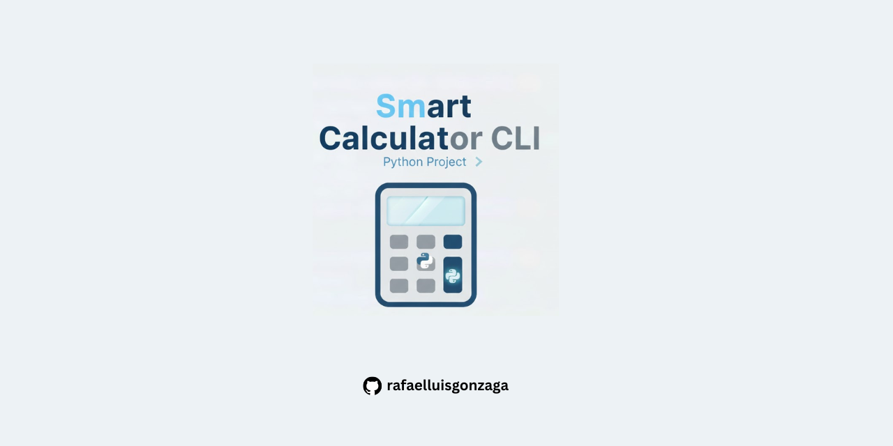

# Smart Calculator CLI

Calculadora em Python desenvolvida como um **mini-projeto profissional**, com foco em
**robustez**, **validação de entrada**, **tratamento de erros** e **boas práticas de código**.

O projeto simula um cenário real de uso em linha de comando (CLI), lidando com
entradas humanas imprevisíveis de forma segura e consistente.

---

## 🎯 Objetivo do Projeto

Demonstrar fundamentos sólidos de Python aplicados a um projeto real:

- organização de código
- separação de responsabilidades
- tratamento de exceções
- testes automatizados
- experiência do usuário no terminal (CLI)

---

## ⚙️ Funcionalidades

- Operações matemáticas básicas:
  - soma
  - subtração
  - multiplicação
  - divisão
- Aceita números com **ponto ou vírgula decimal**
- Tratamento de erros:
  - valores inválidos
  - divisão por zero
- Loop interativo (múltiplos cálculos na mesma execução)
- Saída formatada com **duas casas decimais**
- Código modular e testável

---

## 🗂️ Estrutura do Projeto

```text
app/
├── calculator.py
├── input_handler.py
├── cli.py
├── __init__.py
testes/
├── test_calculator.py
experiments/
├── operacoes.py
├── operacoes_refatored.py
├── operacoes_refatirede_while.py
main.py
pytest.ini
requirements.txt
```

---

## 🧪 Testes Automatizados

### Arquivo: `testes/test_calculator.py`

```python
from app.calculator import calcular

def test_calcular():
    resultado = calcular(10, 5)

    assert resultado["soma"] == 15
    assert resultado["subtracao"] == 5
    assert resultado["multiplicacao"] == 50
    assert resultado["divisao"] == 2
```

### Executar os testes

```bash
python -m pytest -v
```

---

## ▶️ Como Executar

```bash
python main.py
```

---

## 🛠️ Tecnologias

- Python 3.11+
- pytest

---

## 🚀 Próximos Passos

- Criar ambiente virtual (`venv`)
- Adicionar mais testes
- Evoluir para API (FastAPI)
